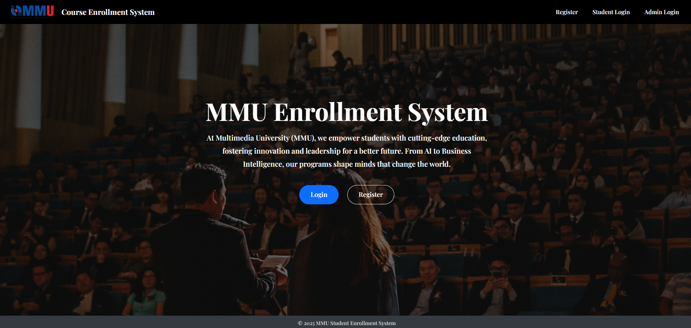

# 🎓 MMU Student Enrollment System

A web-based course enrollment system built with **Python + Flask + SQLite**, designed to streamline student course registration. Developed for the TSE6223 Software Engineering coursework at MMU.
NICHOLAS.TAY.JUN@student.mmu.edu.my
---

## 🖼️ Website Homepage

---

## ✅ Features  

### 👨‍🎓 Student Features
- Student registration & login (with hashed passwords)
- Student Forgot Password
- Department selection during signup
- View & enroll in available courses (filtered by department)
- Real-time **quota checking** and **duplicate prevention**
- Enroll in **Lecture + Tutorial/Lab sections**
- **Time conflict detection** during enrollment
- **Section switching** (change Lecture or Tutorial/Lab)
- View enrolled sections in **"My Courses"**
- 📅 Weekly **Timetable View**
- **Drop entire course** (Lecture + Tutorial)
- **Prerequisite enforcement** (must complete in past semesters)
- **Credit hour restriction** (e.g., FYP requires ≥ 60 credits)
- Student dashboard:
  - Eligible Courses (current semester)
  - Locked Courses (with reason)
  - Completed Courses (past semesters)
- View course details with available Lecture sections
- Profile page with academic summary
- View the credit transfer courses added by admin

### 🧑‍💼 Admin Features
- Admin login/logout
- Add / edit / delete **courses**
- Add / edit / delete **sections**
- Assign **prerequisite course** to new courses
- View all courses and their section breakdown
- View **students enrolled per section**
- View course page grouped by section
- ✅ Set current **active semester** from UI (System Settings)
- Admin dashboard displays **current semester** + Settings link
<<<<<<< HEAD
- Add Credit Trasnfer by Student

=======
- Add and review the credit transfer courses for student
>>>>>>> 3503cf129ad14494030a288f45ea16d1f3a29213
---

## 🛠 Tech Stack

- **Backend**: Python, Flask
- **Frontend**: HTML, Bootstrap 5, Jinja2
- **Database**: SQLite + SQLAlchemy ORM
- **Forms**: Flask-WTF + WTForms
- **Login**: Flask-Login
- **Session / Flash**: Flask session messaging
- **CSRF**: Flask-WTF

---

## 📦 Folder Structure

 

---

## 🚀 How to Run

1. **Clone the project**
git clone https://github.com/your-username/MMU-ENROLLMENT-SYSTEM.git
cd MMU-ENROLLMENT-SYSTEM

2. **Create virtual environment & install dependencies**
python -m venv venv
venv\Scripts\activate
pip install -r requirements.txt

3. **Run the app**
python run.py

---

## 📌 TODO

### 🧠 Smart Features (Future)
- [ ] Conflict prediction (highlight conflicting sections before selection)
- [ ] Auto course suggestion based on completed subjects
- [ ] Multi-semester course roadmap planner

### 🧰 Admin Improvements
- [ ] Search / filter in admin dashboard
- [ ] Export student list to PDF or Excel
- [ ] Dashboard statistics (total enrollment, per dept breakdown)

### 💡 UI/UX Enhancements
- [ ] Search bar in student dashboard
- [ ] Improve error display for forms
- [ ] Responsive layout for mobile view

---

## ✍️ Credits

- **Course**: TSE6223 Software Engineering @ MMU
- **Semester**: April 2025
- **License**: CC BY-NC-ND 4.0
